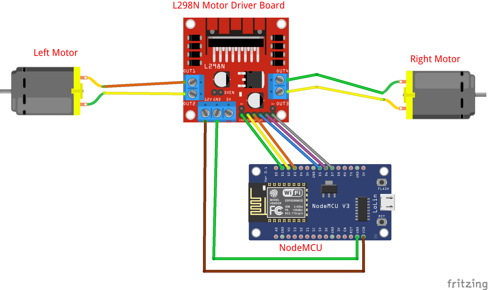

# ESP8266 motor driver

## Hardware Required

* Lolin NodeMCU Board
* Hook-up wires

## Circuit

### ESP82 GPIO
More info RandomNerdTutorial [ESP8266 Pinout Reference: Which GPIO pins should you use?](https://randomnerdtutorials.com/esp8266-pinout-reference-gpios/)

## Schematic
## See also

Rui Santos
  Complete project details at http://randomnerdtutorials.com  
  https://www.instructables.com/DC-Motor-and-Servo-Motor-Control-Via-Web-Server-ES/
  https://surtrtech.com/2018/01/27/step-by-step-on-how-to-use-the-l298n-dual-h-bridge-driver-with-arduino/
  L298N Dual H-Bridge
